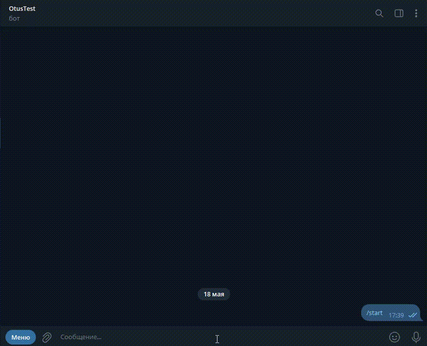
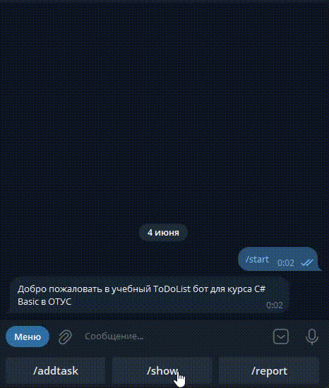
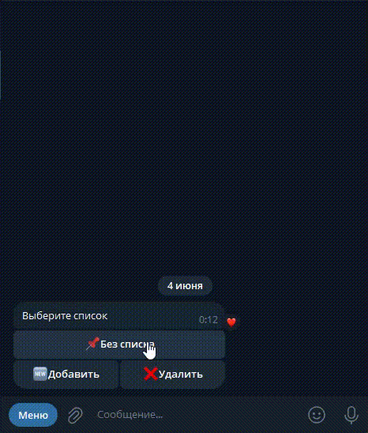

# Домашние задания

## ДЗ № 3. Расширение возможностей бота с помощью списка

**Цель**: Вам предстоит расширить функционал консольного бота, который вы создали в домашнем задании №1, добавив возможности для работы со структурой данных List. Бот будет управлять списком задач с помощью трех новых команд.

### Описание/Пошаговая инструкция выполнения домашнего задания

1. Создайте новую команду /addtask

   - Пользователь сможет добавлять задачи в список.
   - После ввода команды /addtask, бот должен попросить ввести описание задачи.
   - Сохраните задачу в список (или массив) и отобразите сообщение о том, что задача добавлена.

2. Создайте новую команду /showtasks

   - При вводе команды /showtasks бот должен отобразить список всех добавленных задач.
   - Если задачи ещё не добавлены, необходимо вывести сообщение о том, что список пуст.

3. Создайте новую команду /removetask

   - Бот должен позволить пользователю удалять задачи по номеру в списке.
   - После ввода команды /removetask, бот должен отобразить список задач с номерами.
   - Затем бот должен запросить у пользователя номер задачи для удаления и удалить выбранную задачу из списка.

4. Модифицируйте команду /help

   - Обновите команду /help, добавив к ней описание новых команд: /addtask, /showtasks и /removetask.

5. Реализуйте обработку ошибок

   - Если пользователь пытается удалить задачу, когда список пуст, программа должна уведомить его об этом.
   - Также, если введён неверный номер задачи при удалении, бот должен уведомить об этом и попросить ввести корректный номер.

По завершению укажите сколько времени вам понадобилось, чтобы выполнить это задание.

---

### Пример работы программы

```text
Добро пожаловать! Доступные команды: /start, /help, /info, /echo, /addtask, /showtasks, /removetask, /exit

/start

Пожалуйста, введите ваше имя: Иван

Привет, Иван! Чем могу помочь?

/addtask

Пожалуйста, введите описание задачи: Купить продукты

Задача "Купить продукты" добавлена.

/addtask

Пожалуйста, введите описание задачи: Сделать домашнее задание

Задача "Сделать домашнее задание" добавлена.

/showtasks

1. Купить продукты
2. Сделать домашнее задание

/removetask  
 
Вот ваш список задач:

1. Купить продукты
2. Сделать домашнее задание  
 
 Введите номер задачи для удаления: 1  
 Задача "Купить продукты" удалена.

/showtasks
1. Сделать домашнее задание
```

---

Важно! Используйте `List<string>` для хранения задач.

Критерии оценки:

- [x] Пункты 1-3 - 6 баллов  
- [x] Пункт 4 - 2 балла  
- [x] Пункт 5 - 2 балла

Для зачёта домашнего задания достаточно 6 баллов.

Рекомендуем сдать до: 04.12.2024

==Зачтено 02.12.2024==

## ДЗ № 4. Обработка ошибок и валидация данных

**Цель**: Расширение функционала приложения, разработанного в предыдущем домашнем задании:

- Работа с исключениями
- Создание собственного типа исключения
- Валидация данных

### Описание/Пошаговая инструкция выполнения домашнего задания

Перед выполнением нужно ознакомится с [Правила отправки домашнего задания на проверку](https://github.com/OTUS-NET/C-Sharp-Basic/blob/main/Homeworks/README.md)

1. Добавить глобальный try catch
    - Добавьте try catch в метод Main
    - catch должен отлавливать все виды исключений и выводить в консоль сообщение “Произошла непредвиденная ошибка: “ с информацией об исключении (Type, Message, StackTrace, InnerException)
2. Добавить ограничение на максимальное количество задач
    - При старте приложения выводите текст «Введите максимально допустимое количество задач»
    - Ожидайте ввод из консоли. Это должно быть число от 1 до 100, иначе нужно выбросить исключение `ArgumentException` с сообщением.
    - В методе Main добавьте отдельный catch для типа ArgumentException и в нем выводите в консоль только сообщение из исключения.
    - Создайте свой тип исключения `TaskCountLimitException`, который в конструкторе должен принимать только int taskCountLimit, а сообщение должно быть вида `$“Превышено максимальное количество задач равное {taskCountLimit}“` [How to create user-defined exceptions](https://learn.microsoft.com/en-us/dotnet/standard/exceptions/how-to-create-user-defined-exceptions).
    - Добавьте проверку на максимально допустимое количество задач в обработчик команды /addtask. Если количество превышено, то нужно выбросить исключение `TaskCountLimitException`.
    - В методе Main добавьте отдельный catch для типа `TaskCountLimitException` и в нем выводите в консоль только сообщение из исключения.
    - Попадание в catch не должно останавливать работу приложения
3. Добавить ограничение на максимальную длину задачи
    - При старте приложения выводите текст «Введите максимально допустимую длину задачи»
    - Ожидайте ввод из консоли. Это должно быть число от 1 до 100, иначе нужно выбросить исключение `ArgumentException` с сообщением.
    - Создайте свой тип исключения `TaskLengthLimitException`, который в конструкторе должен принимать int taskLength, int taskLengthLimit, а сообщение должно быть вида $“Длина задачи ‘{taskLength}’ превышает максимально допустимое значение {taskLengthLimit}“.
    - Добавьте проверку на максимально допустимую длину задачи в обработчик команды /addtask. Если длина превышена, то нужно выбросить исключение `TaskLengthLimitException`.
    - В методе Main добавьте отдельный catch для типа `TaskLengthLimitException` и в нем выводите в консоль только сообщение из исключения.
    - Попадание в catch не должно останавливать работу приложения
4. Добавить проверку на дубликаты задач
    - Создайте свой тип исключения `DuplicateTaskException`, который в конструкторе должен принимать string task, а сообщение должно быть вида $“Задача ‘{task}’ уже существует“.
    - Добавьте проверку на дубликаты задач в обработчик команды /addtask. Если пользователь пытается добавить уже существующую задачу., то нужно выбросить исключение `DuplicateTaskException`.
    - В методе Main добавьте отдельный catch для типа `DuplicateTaskException`и в нем выводите в консоль только сообщение из исключения.
    - Попадание в catch не должно останавливать работу приложения
5. Добавить метод int ParseAndValidateInt(string? str, int min, int max), который приводит полученную строку к int и проверяет, что оно находится в диапазоне min и max. В противном случае выбрасывать ArgumentException с сообщением. Добавить использование этого метода в приложение.
6. Добавить метод void ValidateString(string? str), который проверяет, что строка не равна null, не равна пустой строке и имеет какие-то символы кроме проблема. В противном случае выбрасывать ArgumentException с сообщением. Добавить использование этого метода в приложение.
7. Вынести обработчики команд в отдельные методы.  

Критерии оценки:

- [x] Пункты 1-3 - 6 баллов
- [x] Пункт 4 - 1 балл
- [x] Пункт 5 - 1 балл
- [x] Пункт 6 - 1 балл
- [x] Пункт 7 - 1 балл

Для зачёта домашнего задания достаточно 6 баллов.  

Рекомендуем сдать до: 11.09.2025

==Зачтено 27.08.2025==

## ДЗ № 5.1 Классы

### Цель

Расширение функционала приложения, разработанного в предыдущих домашних заданиях:

- Работа с классами
- Добавление новых команд

---

### Описание

Перед выполнением нужно ознакомится с [Правила отправки домашнего задания на проверку](https://github.com/OTUS-NET/C-Sharp-Basic/blob/main/Homeworks/README.md)

1. Изменение логики команды `/start`
    - Добавить класс `ToDoUser`
        - Свойства
            - Guid UserId //Заполняется в конструкторе. Guid.NewGuid()
            - string TelegramUserName //Имя пользователя, которое он указал (готовим шаблон для телеграм бота)
            - DateTime RegisteredAt //Заполняется в конструкторе. DateTime.UtcNow
    - У класса должен быть один конструктор с аргументом string telegramUserName
    - Добавить использование класса `ToDoUser` для сохранения информации о пользователе вместо хранения только имени.
2. Добавление класса `ToDoItem`
    - Добавить enum `ToDoItemState` с двумя значениями
        - Active
        - Completed
    - Добавить класс `ToDoItem`
        - Свойства
            - Guid Id //Заполняется в конструкторе. Guid.NewGuid()
            - ToDoUser User
            - string Name
            - DateTime CreatedAt //Заполняется в конструкторе. DateTime.UtcNow
            - ToDoItemState State //Заполняется в конструкторе. ToDoItemState.Active
            - DateTime? StateChangedAt
    - У класса должен быть один конструктор с аргументами ToDoUser user, string name
    - Добавить использование класса `ToDoItem` вместо хранения только имени задачи
3. Изменение логики `/showtasks`
    - Выводить только задачи с `ToDoItemState.Active`
    - Добавить вывод CreatedAt и Id. Пример: Имя задачи - 01.01.2025 00:00:00 - 17056344-0e03-4a21-b0dd-f0d30a5abf49
4. Добавление команды `/completetask`
    - Добавить обработку новой команды `/completetask`
        - Найти задачу по Id
        - Обновить State на ToDoItemState.Completed
        - Обновить StateChangedAt
    - Пример: `/completetask 73c7940a-ca8c-4327-8a15-9119bffd1d5e`
5. Добавление команды `/showalltasks`
    - Добавить обработку новой команды `/showalltasks`. По ней выводить команды с любым `State` и добавить `State` в вывод
    - Пример: (Active) Имя задачи - 01.01.2025 00:00:00 - ffbfe448-4b39-4778-98aa-1aed98f7eed8
6. Обновить `/help`

---

### Критерии оценивания

- [x] Пункт 1 - 2 балла
- [x] Пункт 2 - 2 балла
- [x] Пункт 3 - 2 балла
- [x] Пункт 4 - 2 балла
- [x] Пункт 5 - 1 балл
- [x] Пункт 6 - 1 балл

Для зачёта домашнего задания достаточно 8 баллов.

Рекомендуем сдать до: 22.09.2025.
Сдано: 18.01.2026

## ДЗ № 5.2 ООП Интерфейсы

### Цель
    
Расширение функционала приложения, разработанного в предыдущих домашних заданиях:

- Добавление интерфейсов и классов аналогичных Telegram API, чтобы в будущем было легче переключиться на реального Telegram бота
- Работа с интерфейсами

### Описание

Перед выполнением нужно ознакомится с [Правила отправки домашнего задания на проверку](https://github.com/OTUS-NET/C-Sharp-Basic/blob/main/Homeworks/README.md)

1. Подключение библиотеки `Otus.ToDoList.ConsoleBot`
    - Добавить к себе в решение и в зависимости к своему проекту с ботом проект `Otus.ToDoList.ConsoleBot` [GitHub](https://github.com/OTUS-NET/C-Sharp-Basic/tree/main/Homeworks/05.2%20%D0%9E%D0%9E%D0%9F%20%D0%B8%D0%BD%D1%82%D0%B5%D1%80%D1%84%D0%B5%D0%B9%D1%81%D1%8B/Otus.ToDoList.ConsoleBot). 
    - Ознакомиться с классами в папке Types и с README.md
    - Создать класс `UpdateHandler`, который реализует интерфейс `IUpdateHandler`, и перенести в метод `HandleUpdateAsync` обработку всех команд. Вместо Console.WriteLine использовать `SendMessage` у `ITelegramBotClient`
    - Перенести try/catch в `HandleUpdateAsync`. В Main оставить catch(Exception)
    - Для вывода в консоль сообщений использовать метод `ITelegramBotClient.SendMessage`
    - Код библиотеки `Otus.ToDoList.ConsoleBot` не нужно изменять
2. Удалить команду `/echo`
3. Изменение класса `ToDoUser`
    - Добавить свойство long TelegramUserId
    - В конструктор добавить аргумент long telegramUserId
4. Добавление класса сервиса `UserService`
    - Добавить интерфейс `IUserService`
  
    ```csharp
    interface IUserService
    {
        ToDoUser RegisterUser(long telegramUserId, string telegramUserName);
        ToDoUser? GetUser(long telegramUserId);
    }
    ```

    - Создать класс `UserService`, который реализует интерфейс `IUserService`. Заполнять telegramUserId и telegramUserName нужно из значений `Update.Message.From`
5. Изменение логики команды `/start`
    - Не нужно запрашивать имя
    - Добавить использование `IUserService` в `UpdateHandler`. Получать `IUserService` нужно через конструктор
    - Для обработки команды нужно использовать `IUserService.GetUser`. Если пользователь не найден, то вызывать `IUserService.RegisterUser`
    - Если пользователь не зарегистрирован, то ему доступны только команды `/help` `/info`
6. Добавление класса сервиса `ToDoService`
    - Добавить интерфейс `IToDoService`

    ```csharp
    public interface IToDoService
    {
        IReadOnlyList<ToDoItem> GetAllByUserId(Guid userId);
        //Возвращает ToDoItem для UserId со статусом Active
        IReadOnlyList<ToDoItem> GetActiveByUserId(Guid userId);
        ToDoItem Add(ToDoUser user, string name);
        void MarkCompleted(Guid id);
        void Delete(Guid id);
    }
    ```

    - Создать класс `ToDoService`, который реализует интерфейс `IToDoService`. Перенести в него логику обработки команд. Проверки на максимальное количество задач, на максимальную длину задачи и на дубликаты тоже нужно перенести в `ToDoService`.
    - Добавить использование `IToDoService` в `UpdateHandler`. Получать `IToDoService` нужно через конструктор
    - Изменить формат обработки команды `/addtask`. Нужно сразу передавать имя задачи в команде. Пример: `/addtask Новая задача`
    - Изменить формат обработки команды `/removetask`. Нужно сразу передавать номер задачи в команде. Пример: `/removetask 2`
7. Изменение команды `/completetask`
    - При обработке команды использовать метод `IToDoService.MarkAsCompleted`

Примечание: Можно заменить catch с разными типами исключений, если в них нет кастомной логики, на один catch(Exception ex). Так как в предыдущем задание catch с разными типами исключений добавлялись в учебных целям и в реальных проектах не нужно делать catch на каждый тип исключения, если в них нет специальной логики.

### Критерии оценивания

- [ ] Пункт 1 - 2 балла
- [ ] Пункт 2 - 1 балл
- [ ] Пункт 3 - 1 балл
- [ ] Пункт 4 - 1 балла
- [ ] Пункт 5 - 2 балла
- [ ] Пункт 6 - 2 балла
- [ ] Пункт 7 - 1 балл

Для зачёта домашнего задания достаточно 8 баллов.

## ДЗ № 6 Расширение функциональности бота

### Цель

Расширение функционала приложения, разработанного в предыдущих домашних заданиях:

- Работа с классами и интерфейсами. Добавление репозиториев
- Добавление новых команд
- Работа с лямбдами и кортежами

---

### Описание

Перед выполнением нужно ознакомится с [Правила отправки домашнего задания на проверку](https://github.com/OTUS-NET/C-Sharp-Basic/blob/main/Homeworks/README.md)

1. Добавление репозитория `IUserRepository`
    - Добавить интерфейс `IUserRepository`

    ```csharp
    interface IUserRepository
    {
        ToDoUser? GetUser(Guid userId);
        ToDoUser? GetUserByTelegramUserId(long telegramUserId);
        void Add(ToDoUser user);
    }
    ```

    - Создать класс `InMemoryUserRepository`, который реализует интерфейс `IUserRepository`. В качестве хранилища использовать List
    - Добавить использование `IUserRepository` в `UserService`. Получать `IUserRepository` нужно через конструктор
2. Добавление репозитория `IToDoRepository`
    - Добавить интерфейс `IToDoRepository`

    ```csharp
    interface IToDoRepository
    {
        IReadOnlyList<ToDoItem> GetAllByUserId(Guid userId);
        //Возвращает ToDoItem для UserId со статусом Active
        IReadOnlyList<ToDoItem> GetActiveByUserId(Guid userId);
        ToDoItem? Get(Guid id);
        void Add(ToDoItem item);
        void Update(ToDoItem item);
        void Delete(Guid id);
        //Проверяет есть ли задача с таким именем у пользователя
        bool ExistsByName(Guid userId, string name);
        //Возвращает количество активных задач у пользователя
        int CountActive(Guid userId); 
    }
    ```

    - Создать класс `InMemoryToDoRepository`, который реализует интерфейс `IToDoRepository`. В качестве хранилища использовать List
    - Добавить использование `IToDoRepository` в `ToDoService`. Получать `IToDoRepository` нужно через конструктор
3. Кортежи. Добавление команды `/report`
    - Добавить метод `IReadOnlyList<ToDoItem> GetAllByUserId(Guid userId);` в интерфейс `IToDoRepository`. Метод должен возвращать все задачи пользователя
    - Добавить интерфейс `IToDoReportService`

    ```csharp
    interface IToDoReportService
    {
        (int total, int completed, int active, DateTime generatedAt) GetUserStats(Guid userId);
    }
    ```

    - Создать класс `ToDoReportService`, который реализует интерфейс `IToDoReportService`.
    - Добавить обработку новой команды `/report`. Нужно использовать `IToDoReportService`
    - Пример вывода: Статистика по задачам на 01.01.2025 00:00:00. Всего: 10; Завершенных: 7; Активных: 3;
4. Лямбды. Добавление команды `/find`
    - Добавить метод `IReadOnlyList<ToDoItem> Find(Guid userId, Func<ToDoItem, bool> predicate);` в интерфейс `IToDoRepository`. Метод должен возвращать все задачи пользователя, которые удовлетворяют предикату.
    - Добавить метод `IReadOnlyList<ToDoItem> Find(ToDoUser user, string namePrefix);` в интерфейс `IToDoService`. Метод должен возвращать все задачи пользователя, которые начинаются на namePrefix. Для этого нужно использовать метод `IToDoRepository.Find`
    - Добавить обработку новой команды `/find`.
    - Пример команды: `/find Имя`
    - Вывод в консоль должен быть как в `/showtask`
5. Рекомендуемая структура проекта

    ```text
    Project/
    ├── Core/
    │   ├── DataAccess/
    │   │   ├── IUserRepository.cs
    │   │   ├── IToDoRepository.cs
    │   │   └── ...
    │   ├── Entities/
    │   │   ├── ToDoUser.cs
    │   │   ├── ToDoItem.cs
    │   │   └── ...
    │   ├── Exceptions/
    │   │   ├── TaskCountLimitException.cs
    │   │   ├── TaskLengthLimitException.cs
    │   │   └── ...
    │   └── Services/
    │       ├── IUserService.cs
    │       ├── UserService.cs
    │       └── ...
    │
    ├── Infrastructure/
    │   └── DataAccess/
    │       ├── InMemoryUserRepository.cs
    │       ├── InMemoryToDoRepository.cs
    │       └── ...
    │
    └── TelegramBot/
        ├── UpdateHandler.cs
        └── ...
    ```

6. Обновить `/help`

---

### Критерии оценивания

- [ ] Пункты 1-2 - 5 баллов
- [ ] Пункт 3 - 2 балла
- [ ] Пункт 4 - 2 балла
- [ ] Пункт 5 - 1 балл

Для зачёта домашнего задания достаточно 8 баллов.

---

## ДЗ № 7 Асинхронность, делегаты и события

### Цель

Расширение функционала приложения, разработанного в предыдущих домашних заданиях:

- Добавление асинхронности
- Работа с делегатами и событиями

### Описание/Пошаговая инструкция выполнения домашнего задания

Перед выполнением нужно ознакомится с [Правила отправки домашнего задания на проверку](https://github.com/OTUS-NET/C-Sharp-Basic/blob/main/Homeworks/README.md)

1. Подключение асинхронной библиотеки Otus.ToDoList.ConsoleBot.
   - Добавить к себе в решение и в зависимости к своему проекту с ботом проект `Otus.ToDoList.ConsoleBot` [GitHub](https://github.com/OTUS-NET/C-Sharp-Basic/tree/main/Homeworks/07%20%D0%90%D1%81%D0%B8%D0%BD%D1%85%D1%80%D0%BE%D0%BD%D0%BD%D0%BE%D1%81%D1%82%D1%8C%2C%20%D0%B4%D0%B5%D0%BB%D0%B5%D0%B3%D0%B0%D1%82%D1%8B%20%D0%B8%20%D1%81%D0%BE%D0%B1%D1%8B%D1%82%D0%B8%D1%8F/Otus.ToDoList.ConsoleBot) вместо аналогичного проекта добавленного в рамках ДЗ "ООП классы и интерфейсы".
   - Ознакомиться с README.md.
   - Переключиться на использование асинхронных методов из библиотеки `Otus.ToDoList.ConsoleBot`. Обратите внимание на методы из `IUpdateHandler` и `ITelegramBotClient`.
   - Реализовать метод `IUpdateHandler.HandleErrorAsync`. В нем нужно выводить информацию об ошибке в консоль.
   - В метод `ITelegramBotClient.StartReceiving` нужно передавать `CancellationToken`. Его нужно создать с помощью `CancellationTokenSource`.
   - Код библиотеки `Otus.ToDoList.ConsoleBot` **не нужно изменять**.
2. Добавление делегатов и событий.
   - Создать делегат типа `MessageEventHandler`, который принимает `string message`, а возвращает `void`.
   - В класс `UpdateHandler` добавить события `OnHandleUpdateStarted` и `OnHandleUpdateCompleted`. Они должны быть типа `MessageEventHandler`.
   - События должны срабатывать в начале и в конце обработки сообщений.
   - После создании `UpdateHandler` подписаться на эти события, а в обработчиках выводить соответствующие уведомления в консоль: `"Началась обработка сообщения '{message}'"` и `"Закончилась обработка сообщения '{message}'"`.
   - При завершении работы приложения не забудьте отписаться от событий. Для этого можно использовать `try/finally`.
3. Перевод интерфейсов на асинхронность.
   - Мигрировать синхронные методы всех интерфейсов на асинхронные. Методы должны возвращать `Task` или `Task<>` и получать `CancellationToken`.
   - `IUserService`, `IUserRepository`, `IToDoService`, `IToDoRepository` и т.д.

---

### Критерии оценки

- [ ] Пункт 1 - 6 баллов
- [ ] Пункт 2 - 2 балла
- [ ] Пункт 3 - 2 балла

Для зачёта домашнего задания достаточно 8 баллов.

---

## ДЗ № 8 Создание Telegram бота

### Цель

Расширение функционала приложения, разработанного в предыдущих домашних заданиях:

- Создать своего Telegram бота
- Работа с Telegram Bot API
- Работа с Reply кнопками

---

### Описание и пошаговая инструкция

Перед выполнением нужно ознакомится с [Правила отправки домашнего задания на проверку](https://github.com/OTUS-NET/C-Sharp-Basic/blob/main/Homeworks/README.md)

1. Создайте Telegram-бота через [BotFather](https://core.telegram.org/bots/features#botfather).
2. Замена `Otus.ToDoList.ConsoleBot` на библиотеку [Telegram.Bot](https://github.com/TelegramBots/Telegram.Bot).
    - Удалить `Otus.ToDoList.ConsoleBot`
    - Добавить nuget пакет [Telegram.Bot](https://github.com/TelegramBots/Telegram.Bot).
    - Убедиться, что интерфейсы `IUpdateHandler` и `ITelegramBotClient` из `Otus.ToDoList.ConsoleBot` совместимы с аналогичными интерфейсами из `Telegram.Bot`. Поправить using-и в файлах.
    - Заменить `ConsoleBotClient` на `TelegramBotClient`
    - Пример кода:
  
    ```csharp
    var botClient = new TelegramBotClient("<token>");
    var receiverOptions = new ReceiverOptions
    {
        AllowedUpdates = [UpdateType.Message],
        DropPendingUpdates = true
    };
    var handler = new UpdateHandler();
    botClient.StartReceiving(handler, receiverOptions);

    var me = await botClient.GetMe();
    Console.WriteLine($"{me.FirstName} запущен!");

    await Task.Delay(-1); // Устанавливаем бесконечную задержку
    ```

3. Отмена асинхронных операции и остановка приложения при нажатии клавиши "A".
    - После запуска Telegram-бота выводите текст "Нажмите клавишу 'A' для выхода" в консоль и ожидайте нажатия любой клавиши.
    - Если нажата клавиша "A" - выходите из программы и отмените все асинхронные операции. В противном случае выводите информацию о Telegram-боте. Информацию нужно взять из метода `botClient.GetMe()`
    - Реализовать отмену асинхронной операции нужно с использованием `CancellationTokenSource`.
4. Добавить `Reply` кнопки с командами.
    - До регистрации должна быть доступна только одна кнопка c командой `/start`.
    - После регистрации должны быть доступны кнопки c командами `/showalltasks` `/showtasks` `/report`.
    - Кнопки создаются через класс `ReplyKeyboardMarkup`.
    - При выводе команд `/showalltasks` и `/showtasks` обернуть Id задачи в символы "`", чтобы их было удобно копировать.
5. Добавить описание команд в нативную кнопку `Menu`.
    - Это нужно сделать через метод `ITelegramBotClient.SetMyCommands`.

**Советы:**

1. Избегайте утечку токена вашего Telegram-бота. При отправки ДЗ на проверку убедитесь, что в коде нет токена. Также не делай коммиты в git-репозиторий с токеном.
2. При использование markdown нужно экранировать некоторые спецсимволы https://core.telegram.org/bots/api#markdownv2-style.
3. Полезные ресурсы.
    - Документация библиотеки: https://github.com/TelegramBots/Telegram.Bot.
    - Пример реализации: https://github.com/TelegramBots/Telegram.Bot.Examples.

---

### Критерии оценивания

- Пункты 1-2 - 6 баллов
- Пункт 3 - 2 балла
- Пункт 4 - 1 балла
- Пункт 5 - 1 балла

Для зачёта домашнего задания достаточно 8 баллов.

---

## ДЗ № 9 Работа с файлами

### Цель

Расширение функционала приложения, разработанного в предыдущих домашних заданиях:

- Работа с файлами
- Работа с json

---

### Описание и инструкция

Перед выполнением нужно ознакомится с [Правила отправки домашнего задания на проверку](https://github.com/OTUS-NET/C-Sharp-Basic/blob/main/Homeworks/README.md)

1. Перенос хранения `ToDoItem` данных в файлы.
    - Создать класс `FileToDoRepository`, который реализует интерфейс `IToDoRepository`.
    - Реализовать хранение `ToDoItem` в отдельных json файлах.
        - Имя файла: `"{ToDoItem.Id}.json"`.
    - Имя базовой папки нужно получать через конструктор. Папку нужно создавать если её нет.
    - Для хранения данных в файлах использовать json формат. Для этого нужно использовать библиотеку `System.Text.Json` и методы `JsonSerializer.Serialize` `JsonSerializer.Deserialize`. Можно использовать асинхронные варианты. [Документация](https://learn.microsoft.com/ru-ru/dotnet/standard/serialization/).
    - Заменить использование `InMemoryToDoRepository` на `FileToDoRepository` в проекте.
2. Перенос хранения `ToDoUser` данных в файлы.
    - Создать класс `FileUserRepository`, который реализует интерфейс `IUserRepository`.
    - Реализовать хранение `ToDoUser` в отдельных json файлах.
        - Имя файла: `"{ToDoUser.UserId}.json"`.
    - Имя базовой папки нужно получать через конструктор. Папку нужно создавать если её нет.
    - Для хранения данных в файлах использовать JSON формат. Для этого нужно использовать библиотеку `System.Text.Json`.
    - Заменить использование `InMemoryUserRepository` на `FileUserRepository` в проекте.
3. Оптимизация поиска `ToDoItem` по `UserId`.
    - Реализовать в `FileToDoRepository` хранение `ToDoItem` в отдельных json файлах, сгруппированных по `UserId` в папках.
    - Имя папки: `"{ToDoItem.User.UserId}"`.
    - Имя файла: `"{ToDoItem.Id}.json"`.
4. Индекс для оптимизации удаления `ToDoItem`.
    - Добавить в `FileToDoRepository` файл индекс в json формате, в котором хранятся связки `ToDoItemId` и `UserId`
    - Наполнять индекс в методе `FileToDoRepository.Add`
    - Использовать и обновлять индекс в методе `FileToDoRepository.Delete`.
    - Если файла индекса нет, то создать файл и наполнить его актуальными данными через сканирование всех папок.

**Ознакомительное примечание (выполнять не нужно):**
Для безопасной работы с файлами в многопоточной среде рекомендуется использовать синхронизацию потоков, чтобы в один момент времени с файлом работал только один поток. Это поможет избежать race conditions, повреждение данных, IO исключений и тд. Для этого хорошо подходит [SemaphoreSlim](https://learn.microsoft.com/ru-ru/dotnet/api/system.threading.semaphoreslim), так как он поддерживает асинхронность, оптимизирован для внутрипроцессной синхронизации и не использует объекты ядра ОС. Например, в нашем случае можно было использовать отдельные `SemaphoreSlim` для каждого `UserId`. Данная тема выходит за рамки курса.

---

### Критерии оценивания

- [ ] Пункт 1 - 3 балла
- [ ] Пункт 2 - 3 балла
- [ ] Пункт 3 - 2 балла
- [ ] Пункт 4 - 2 балла

Для зачёта домашнего задания достаточно 6 баллов.

---

## ДЗ № 10 Сценарии

### Цель
    
Расширение функционала приложения, разработанного в предыдущих домашних заданиях:

- Добавление поддержки сценариев с сохранением промежуточного состояния
- Добавление сценария для создания задачи
- Работа с Dictionary

---

### Описание

Ссылка на [GitHub](https://github.com/OTUS-NET/C-Sharp-Basic/blob/main/Homeworks/10%20%D0%A1%D1%86%D0%B5%D0%BD%D0%B0%D1%80%D0%B8%D0%B8/Task.md)

Перед выполнением нужно ознакомится с [Правила отправки домашнего задания на проверку](https://github.com/OTUS-NET/C-Sharp-Basic/blob/main/Homeworks/README.md)

В данном ДЗ добавляется поддержка сценариев - это последовательный набор действий с сохранением промежуточного состояния. Они нужны для обработки цепочек действий, поддержки диалога и улучшения UX.


1. Добавление `ScenarioContext`. Класс, который будет хранить информацию о контексте(сессии) пользователя.
    - Добавить enum `ScenarioType`. В нем будем хранить все поддерживаемые сценарии. Значениями:
        - `None`
        - `AddTask`
    - Добавить класс `ScenarioContext`
        - Свойства
            - `long UserId` //Id пользователя в Telegram
            - `ScenarioType CurrentScenario`
            - `string? CurrentStep` //Текущий шаг сценария
            - `Dictionary<string, object> Data` //Дополнительная инфрмация, необходимая для работы сценария
        - Конструктор `ScenarioContext(ScenarioType scenario)`
    - Добавить интерфейс
  
    ```csharp
    //Репозиторий, который отвечает за доступ к контекстам пользователей
    public interface IScenarioContextRepository
    {
        //Получить контекст пользователя
        Task<ScenarioContext?> GetContext(long userId, CancellationToken ct);
        //Задать контекст пользователя
        Task SetContext(long userId, ScenarioContext context, CancellationToken ct);
        //Сбросить (очистить) контекст пользователя
        Task ResetContext(long userId, CancellationToken ct);
    }
    ```

    - Создать класс `InMemoryScenarioContextRepository`, который реализует интерфейс `IScenarioContextRepository`. В качестве хранилища использовать `Dictionary<long, ScenarioContext>`
    - Файлы (классы и интерфейсы) размещать в папке `./TelegramBot/Scenarios`
2. Добавление поддержки сценариев
    - Добавить enum `ScenarioResult`. Нужен для получения результата выполнения сценария. Значениями:
        - Transition - Переход к следующему шагу. Сообщение обработано, но сценарий еще не завершен
        - Completed - Сценарий завершен
    - Добавить интерфейс `IScenario`. Нужен для определения логики работы сценариев.
  
    ```csharp
    public interface IScenario
    {
        //Проверяет, может ли текущий сценарий обрабатывать указанный тип сценария.
        //Используется для определения подходящего обработчика в системе сценариев.
        bool CanHandle(ScenarioType scenario);
        //Обрабатывает входящее сообщение от пользователя в рамках текущего сценария.
        //Включает основную бизнес-логику
        Task<ScenarioResult> HandleMessageAsync(ITelegramBotClient bot, ScenarioContext context, Update update, CancellationToken ct);
    }
    ```

3. Обновление `UpdateHandler` для поддержки сценариев
    - Добавить в конструктор аргументы:
        - `IEnumerable<IScenario>` scenarios
        - IScenarioContextRepository contextRepository
    - Добавить метод `IScenario GetScenario(ScenarioType scenario)`, который возвращает соответствующий сценарий. Если сценарий не найден, то выбрасывать исключение.
    - Добавить метод `Task ProcessScenario(ScenarioContext context, Update update, CancellationToken ct)`
        - Получает сценарий через метод `GetScenario`
        - Вызывает метод `IScenario.HandleMessageAsync`
        - ЕСЛИ метод вернул ScenarioResult.Completed, TO вызвать `IScenarioContextRepository.ResetContext`
        - ИНАЧЕ вызвать `IScenarioContextRepository.SetContext`
    - В метод `HandleUpdateAsync` добавить получение `ScenarioContext` через `IScenarioContextRepository` перед обработкой команд.
        - ЕСЛИ `ScenarioContext` найден, ТО вызвать метод `ProcessScenario` и завершить обработку
4. Добавление `AddTaskScenario`
    - Добавить класс `AddTaskScenario`, который реализует интерфейс `IScenario` и в конструкторе принимает `IUserService` и `IToDoService`
    - Добавить обработку шагов сценария (`ScenarioContext.CurrentStep`) через switch case
        - case null
            - Получить `ToDoUser` и сохранить его в `ScenarioContext.Data`.
            - Отправить пользователю сообщение "Введите название задачи:"
            - Обновить `ScenarioContext.CurrentStep` на "Name"
            - Вернуть `ScenarioResult.Transition`
        - case "Name"
            - Вызвать `IToDoService.Add`. Передать `ToDoUser` из `ScenarioContext.Data` и name из сообщения
            - Вернуть `ScenarioResult.Completed`
    - Обновить обработку команды `/addtask` в `UpdateHandler`
        - При получении команды `/addtask` создать `ScenarioContext` c `ScenarioType.AddTask` и вызвать метод `ProcessScenario`
    - Добавить кнопку `/addtask` через класс `ReplyKeyboardMarkup`
5. Добавление команды `/cancel` для остановки сценариев
    - При получении команды `/cancel` нужно вызвать метод `IScenarioContextRepository.ResetContext`
    - Обрабатывать команду нужно до запуска `ProcessScenario`
    - При запуске сценария у пользователя должна быть доступна одна кнопка `/cancel` через `ReplyKeyboardMarkup`
    - После завершения или отмены сценария должны вернуться кнопки с командами (/addtask, /showtask и тд)
    - Обновить `/help`
6. Добавление Deadline в `ToDoItem`
    - Добавить свойство DateTime Deadline в `ToDoItem`
    - Добавить аргумент DateTime deadline в `IToDoService.Add`
    - Добавить заполнение Deadline в `AddTaskScenario` через отдельный шаг. Формат текста dd.MM.yyyy. 
    - Если пользователь введет дату в неверном формате, сценарий не должен прерваться и нужно еще раз запросить дату.

---

### Критерии оценивания

- Пункт 1 - 2 балла
- Пункт 2 - 2 балла
- Пункт 3 - 2 балла
- Пункт 4 - 2 балла
- Пункт 5 - 1 балл
- Пункт 6 - 1 балл

Для зачёта домашнего задания достаточно 8 баллов.

---

### Цель
    
Расширение функционала приложения, разработанного в предыдущих домашних заданиях:

- Добавление сущности ToDoList
- Расширение сценария создания задачи
- Добавление сценариев для создания и удаления списков
- Работа с CallbackQuery
- Работа с ConcurrentDictionary

---

## ДЗ № 11 Списки задач

### Описание

Ссылка на [GitHub](https://github.com/OTUS-NET/C-Sharp-Basic/blob/main/Homeworks/11%20%D0%A1%D0%BF%D0%B8%D1%81%D0%BA%D0%B8%20%D0%B4%D0%BB%D1%8F%20%D0%B7%D0%B0%D0%B4%D0%B0%D1%87/Task.md)

Перед выполнением нужно ознакомится с [Правила отправки домашнего задания на проверку](https://github.com/OTUS-NET/C-Sharp-Basic/blob/main/Homeworks/README.md)

В данном ДЗ добавляется поддержка списков для задач. Удобный функционал, чтобы сгуппировать задачи по смыслу.



1. В `InMemoryScenarioContextRepository` заменить использование `Dictionary` на `ConcurrentDictionary`
2. Добавление сущности `ToDoList`
    - Добавить класс `ToDoList` по пути Core/Entities
        - Свойства
            - Guid Id
            - string Name
            - ToDoUser User
            - DateTime CreatedAt
    - Добавить свойство ToDoList? List в `ToDoItem`
    - Добавить аргумент ToDoList? list в `IToDoService.Add`
3. Добавление класса сервиса и репозитория для `ToDoList`
    - Добавить интерфейс `IToDoListRepository`
    ```csharp
    public interface IToDoListRepository
    {
        //Если спика нет, то возвращает null
        Task<ToDoList?> Get(Guid id, CancellationToken ct);
        Task<IReadOnlyList<ToDoList>> GetByUserId(Guid userId, CancellationToken ct);
        Task Add(ToDoList list, CancellationToken ct);
        Task Delete(Guid id, CancellationToken ct);
        //Проверяет, если ли у пользователя список с таким именем
        Task<bool> ExistsByName(Guid userId, string name, CancellationToken ct);
    }
    ```
    - Создать класс `FileToDoListRepository`, который реализует интерфейс `IToDoListRepository`. Реализовать класс аналогично `FileUserRepository`
    - Добавить интерфейс `IToDoListService`
    ```csharp
    public interface IToDoListService
    {
        Task<ToDoList> Add(ToDoUser user, string name, CancellationToken ct);
        Task<ToDoList?> Get(Guid id, CancellationToken ct);
        Task Delete(Guid id, CancellationToken ct);
        Task<IReadOnlyList<ToDoList>> GetUserLists(Guid userId, CancellationToken ct);
    }
    ```
    - Создать класс `ToDoListService`, который реализует интерфейс `IToDoListService`
        - Размер имени списка не может быть больше 10 символом
        - Название списка должно быть уникально в рамках одного ToDoUser
    - Добавить метод `Task<IReadOnlyList<ToDoItem>> GetByUserIdAndList(Guid userId, Guid? listId, CancellationToken ct);` в интерфейс `IToDoService` и реализовать его
4. Изменение команды /showtasks
    - Добавить `IToDoListService` в `UpdateHandler` через конструктор.
    - Переименовать команду /showtasks в /show
    - Команду /showalltasks удалить
    - Создать Dto классы с помощью которых мы будет работать с `CallbackQuery`. Разместить их в `TelegramBot/Dto`
        - Класс `CallbackDto`. Общий класс в котором есть `Action`
            Свойства:
                - string Action //с помощью него будет определять за какое действие отвечает кнопка
            Методы:
                - public static CallbackDto FromString(string input) //На вход принимает строку ввида "{action}|{prop1}|{prop2}...". Нужно создать CallbackDto с Action = action. Нужно учесть что в строке может не быть |, тогда всю строку сохраняем в Action.
                - public override string ToString() - переопределить метод. Он должен возвращать Action
        - Класс `ToDoListCallbackDto`. Наследовать от CallbackDto. Помимо `Action`, есть `ToDoListId`
            Свойства:
                -  Guid? ToDoListId
            Методы:
                - public static new ToDoListCallbackDto FromString(string input) //На вход принимает строку ввида "{action}|{toDoListId}|{prop2}...". Нужно создать ToDoListCallbackDto с Action = action и ToDoListId = toDoListId.
                - public override string ToString() - переопределить метод. Он должен возвращать $"{base.ToString()}|{ToDoListId}"
    - При получении команды /show нужно отправлять сообщение с текстом "Выберите список" и кнопками InlineKeyboardButton (см. Демонстрация работы бота)
        - Для этого нужно использовать класс `InlineKeyboardMarkup` и добавлять в него кнопки с помощью `InlineKeyboardButton.WithCallbackData(string text, string callbackData)`
        - Максимальный размер callbackData составляет 64 символа, поэтому в классах `CallbackDto` мы будем использовать компактный формат приведение к строкам
        - Для "📌Без списка" в callbackData пишем ToDoListCallbackDto.ToString(). Action = "show", ToDoListId = null
        - Для остальных списков в callbackData пишем ToDoListCallbackDto.ToString(). Action = "show", ToDoListId = Id
        - Для "🆕Добавить" в callbackData пишем "addlist". Для "❌Удалить" в callbackData пишем "deletelist"
5. Обработка нажатия на кнопки
    - В UpdateHandler добавить обработки нажатия на Inline кнопки. За это отвечает update.CallbackQuery. Пример:
    ```csharp
    await (update switch
    {
        { Message: { } message } => OnMessage(update, message, ct),
        { CallbackQuery: { } callbackQuery } => OnCallbackQuery(update, callbackQuery, ct),
        _ => OnUnknown(update)
    });
    ```
    - В `OnCallbackQuery` добавить проверку на то, что пользователь зарегистрирован. Незарегистрированным пользователям `CallbackQuery` не обрабатываем. Также нужно проверять запущен ли для пользователя сценарий и вызывать `ProcessScenario`
    - Чтобы получать обновления по `CallbackQuery` нужно добавить его в ReceiverOptions.AllowedUpdates
    - При получении `CallbackQuery` создаем `CallbackDto` с помощью CallbackDto.FromString(query.Data)
    - ЕСЛИ Action равен
        - "show" TO получить `ToDoListCallbackDto` и вернуть задачи, которые привязаны к списку ToDoListCallbackDto.ToDoListId
6. Добавление и удаление списка
    - Добавить `AddList` в `ScenarioType`
    - Добавить класс `AddListScenario`, который реализует интерфейс `IScenario` и в конструкторе принимает `IUserService` и `IToDoListService`
    - Добавить обработку шагов сценария (`ScenarioContext.CurrentStep`) через switch case
        - case null
            - Получить `ToDoUser` и сохранить его в `ScenarioContext.Data`.
            - Отправить пользователю сообщение "Введите название списка:"
            - Обновить `ScenarioContext.CurrentStep` на "Name"
            - Вернуть `ScenarioResult.Transition`
        - case "Name"
            - Вызвать `IToDoListService.Add`. Передать `ToDoUser` из `ScenarioContext.Data` и name из сообщения
            - Вернуть `ScenarioResult.Completed`
    - При нажатии на кнопку "🆕Добавить" должен запускаться сценарий `AddListScenario`
    - Добавить `DeleteList` в `ScenarioType`
    - Добавить класс `DeleteListScenario`, который реализует интерфейс `IScenario` и в конструкторе принимает `IUserService`, `IToDoListService` и `IToDoService`
    - Добавить обработку шагов сценария (`ScenarioContext.CurrentStep`) через switch case
        - case null
            - Получить `ToDoUser` и сохранить его в `ScenarioContext.Data`.
            - Отправить пользователю сообщение "Выберете список для удаления:" с Inline кнопками. callbackData = ToDoListCallbackDto.ToString(). Action = "deletelist"
            - Обновить `ScenarioContext.CurrentStep` на "Approve"
        - case "Approve"
            - Получить `ToDoList` и сохранить его в `ScenarioContext.Data`.
            - Отправить пользователю сообщение "Подтверждаете удаление списка {toDoList.Name} и всех его задач" с Inline кнопками: WithCallbackData("✅Да", "yes"), WithCallbackData("❌Нет", "no")
            - Обновить `ScenarioContext.CurrentStep` на "Delete"
        - case "Delete"
            - ЕСЛИ update.CallbackQuery.Data равна
            - "yes" ТО удалить все задачи по `ToDoUser` и `ToDoList`. Удалить `ToDoList`. 
            - "no" ТО отправить сообщение "Удаление отменено".
            - Вернуть `ScenarioResult.Completed`.
    - При нажатии на кнопку "❌Удалить" должен запускаться сценарий `DeleteListScenario`
7. Добавить выбор списка в сценарий `AddTaskScenario`
    - Добавить заполнение `ToDoList` в `AddTaskScenario` через отдельный шаг
    - Выбирать список нужно через Inline кнопки (см. Демонстрация работы бота)
    - Обработка update.CallbackQuery должна быть внутри `AddTaskScenario`
8. Вне сценариев пользователю должны быть доступны кнопки ["/addtask", "/show", "/report"] через `ReplyKeyboardMarkup`.
9. Обновить /help

Примеры работы с Telegram API: https://github.com/TelegramBots/Telegram.Bot.Examples

---

### Критерии оценивания

- Пункты 1-3 - 2 балла
- Пункт 4 - 2 балла
- Пункт 5 - 2 балла
- Пункт 6 - 2 балла
- Пункт 7 - 1 балл
- Пункты 8-9 - 1 балл

Для зачёта домашнего задания достаточно 8 баллов.

---

## ДЗ № 12 Постраничная навигация

### Цель
    
Расширение функционала приложения, разработанного в предыдущих домашних заданиях:

- Изменение вывода информации о задаче
- Добавление сценария удаления задачи
- Добавление просмотра выполненных задач
- Практики по LINQ
- Добавление постраничной навигации при выводе задач

---

### Описание

Ссылка на [GitHub](https://github.com/OTUS-NET/C-Sharp-Basic/blob/main/Homeworks/12%20%D0%9F%D0%BE%D1%81%D1%82%D1%80%D0%B0%D0%BD%D0%B8%D1%87%D0%BD%D0%B0%D1%8F%20%D0%BD%D0%B0%D0%B2%D0%B8%D0%B3%D0%B0%D1%86%D0%B8%D1%8F/Task.md)

Перед выполнением нужно ознакомится с [Правила отправки домашнего задания на проверку](https://github.com/OTUS-NET/C-Sharp-Basic/blob/main/Homeworks/README.md)

Демонстрация работы постраничной навигации



Демонстрация работы просмотра выполненных задач



1. Изменение вывода информации о задачах. Добавление кнопок для выполнения и удаления задач
    - Добавить метод в интерфейс `IToDoService`
        - Task<ToDoItem?> Get(Guid toDoItemId, CancellationToken ct);
    - Добавить класс `ToDoItemCallbackDto`. Наследовать от CallbackDto. Реализовать аналогично `ToDoListCallbackDto`
            Свойства:
                -  Guid ToDoItemId
            Методы:
                - public static new ToDoItemCallbackDto FromString(string input)
                - public override string ToString()
    - При обрботке команды Action = "show" (через Inline кнопки) добавить в кнопки с задачами в callbackData ToDoItemCallbackDto.ToString(). Action = "showtask", ToDoItemId = Id
    - В метод `OnCallbackQuery` добавить обработку
        - ЕСЛИ Action равен
            - "showtask" TO получить `ToDoItemCallbackDto` и вернуть информацию о задаче с Inline кнопками:
                - "✅Выполнить" в callbackData пишем ToDoItemCallbackDto.ToString(). Action = "completetask", ToDoItemId = Id
                - "❌Удалить" в callbackData пишем ToDoItemCallbackDto.ToString(). Action = "deletetask", ToDoItemId = Id
    - Добавить обработку Action = "completetask" и Action = "deletetask" в метод `OnCallbackQuery`
    - Удалить обработку текстовых команд /completetask и /removetask
2. Создание метода расширения LINQ для пагинации
    - Создать статический класс `EnumerableExtension` в папке Helpers
    - Реализовать метод расширения `GetBatchByNumber` для IEnumerable<TSource>
    - Метод должен принимать 
        - int batchSize //размер пачки
        - int batchNumber //номер возвращаемой пачки, нумерация с 0 
    - Метод должен возвращать подмножество элементов из последовательности IEnumerable<TSource>, основываясь на размере партии и её номере.
    - Пример: [1, 2, 3, 4, 5, 6, 7, 8, 9, 10] для batchSize = 3 и batchNumber = 1 результат будет [4, 5, 6]
3. Реализация пагинации
    - Добавить класс `PagedListCallbackDto`. Наследовать от `ToDoListCallbackDto`.
            Свойства:
                - int Page 
            Методы:
                - public static new PagedListCallbackDto FromString(string input)
                - public override string ToString() - Возвращает $"{base.ToString()}|{Page}"
    - Перейти на использовать `PagedListCallbackDto` вместо `ToDoListCallbackDto` при обработке команд Action = "show". Пока Page = 0.
    - Добавить приватное статическое поле int _pageSize = 5; в `UpdateHandler`. Оно отвечает за количество кнопок на одной странице
    - Создать приватный метод `BuildPagedButtons` в `UpdateHandler`. 
        - Возвращает `InlineKeyboardMarkup`
        - Аргументы:
            - IReadOnlyList<KeyValuePair<string, string>> callbackData - общий набор кнопок. Ключ - имя кнопки, Значение - callbackData
            - PagedListCallbackDto listDto
        - Логика:
            - Расчитать общее количество страниц.
            - Создать InlineKeyboardMarkup и добавить кнопки относящие только к конкретной странице с помощью GetBatchByNumber(_pageSize, listDto.Page)
            - Если listDto.Page > 0 то добавить кнопку ⬅️ с PagedListCallbackDto(listDto.Action, listDto.ToDoListId, page - 1)
            - Если listDto.Page < totalPages - 1 то добавить кнопку ➡️ с PagedListCallbackDto(listDto.Action, listDto.ToDoListId, page + 1)
    - Использовать метод `BuildPagedButtons` при обработке Action = "show"
    - При при переключении между страницами и переходе от списка к задачам должно присылаться не новое сообщение, а изменяться текущее. Это можно реализовать с помощью метода `bot.EditMessageText`. См. демонстрацию
4. Добавление просмотра выполненных задач
    - При обработке команды Action = "show" добавить вывод кнопки "☑️Посмотреть выполненные" с PagedListCallbackDto("show_completed", ToDoListId, 0)
    - Добавить обработку команды Action = "show_completed" в метод `OnCallbackQuery`. Должна поддерживаться пагинация
    - Если задач нет, то выводить сообщение "Задач нет"
5. Добавление сценария `DeleteTaskScenario`
    - Добавить `DeleteTask` в `ScenarioType`
    - Добавить класс `DeleteTaskScenario`, который реализует интерфейс `IScenario` и в конструкторе принимает `IToDoService`
    - Реализовать аналогично `DeleteListScenario`. Должно быть подтверждение у пользователя при удалении (см. Демонстрацию)
    - При нажатии на кнопку "❌Удалить" c Action = "deletetask" должен запускаться сценарий `DeleteTaskScenario`
6. (Опционально) Пройтись по проекту и добавить использование LINQ там, где это возможно
7. Обновить /help и bot.SetMyCommands

---

### Критерии оценивания

- Пункт 1 - 2 балла
- Пункт 2 - 2 балла
- Пункт 3 - 2 балла
- Пункт 4 - 2 балла
- Пункт 5 - 1 балл
- Пункты 6-7 - 1 балл

Для зачёта домашнего задания достаточно 8 баллов.

---

## ДЗ № 13 Модель базы данных

### Цель
    
Проектирование модели базы данных для приложения, разработанного в предыдущих домашних заданиях:

- Проектировать модель БД
- Писать DDL скрипты
- Писать DML скрипты
- Создавать индексы

---

### Описание

Ссылка на [GitHub](https://github.com/OTUS-NET/C-Sharp-Basic/blob/main/Homeworks/13%20%D0%9C%D0%BE%D0%B4%D0%B5%D0%BB%D1%8C%20%D0%B1%D0%B0%D0%B7%D1%8B%20%D0%B4%D0%B0%D0%BD%D0%BD%D1%8B%D1%85/Task.md)

Перед выполнением нужно ознакомится с [Правила отправки домашнего задания на проверку](https://github.com/OTUS-NET/C-Sharp-Basic/blob/main/Homeworks/README.md)

1. Установка PostgreSQL
    - Установите PostgreSQL на локальный компьютер (см. материалы занятия)
    - Создать новую БД с именем ToDoList
2. Проектирование модели базы данных
    - Таблицы на основе классов из Core/Entities. У таблиц должны быть PRIMARY KEY. Для ToDoItemState можно использовать тип INT
        - ToDoUser
        - ToDoList
        - ToDoItem
    - Cвязи между таблицами (внешние ключи)
        - ToDoList.UserId -> ToDoUser
        - ToDoItem.UserId -> ToDoUser
        - ToDoItem.ListId -> ToDoList
    - Напишите SQL-скрипты для создания таблиц и внешних ключей
3. Проектирование индексов
    - Создайте индексы для всех внешних ключей
    - Создайте уникальный индекс для ToDoUser.TelegramUserId
    - Сохраните все скрипты (создание таблиц, внешних ключей и индексов) в один файл ToDoListDb.sql
    - Разместите файл в репозитории рядом с проектом
4. Заполнение базы данных
    - Напишите SQL-скрипты для заполнения всех таблиц тестовыми данными (минимум 2 записи на таблицу)
    - Сохраните скрипт в файл ToDoListDb_Insert.sql
    - Разместите файл в репозитории рядом с проектом
5. Выборка данных
    - Напишите SQL-скрипты для методов интерфейса IToDoRepository, которые выбирают данные
    - Сохраните скрипты в файл ToDoListDb_Select.sql
    - Разместите файл в репозитории рядом с проектом

Примечание: Используйте двойные кавычки для имен таблиц, столбцов, индексов и тд, чтобы сохранить регистр.

---

### Критерии оценивания

- Пункт 1 - 2 балла
- Пункт 2 - 2 балла
- Пункт 3 - 2 балла
- Пункт 4 - 2 балла
- Пункт 5 - 2 балла

Для зачёта домашнего задания достаточно 8 баллов.

---
